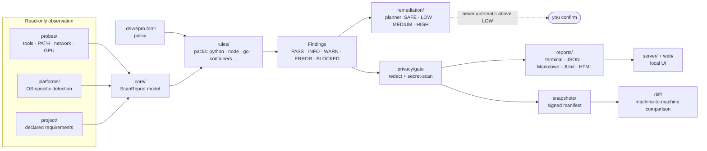

# DevRepro Doctor 🩺 — find out why this repo won't build on *this* machine

<!-- badges -->
[](https://github.com/webdevsamran/devrepro-doctor/actions/workflows/ci.yml)
[](https://github.com/webdevsamran/devrepro-doctor/actions/workflows/codeql.yml)
[](https://github.com/webdevsamran/devrepro-doctor/releases)
[](https://github.com/webdevsamran/devrepro-doctor/blob/main/LICENSE)
[](pyproject.toml)
[](pyproject.toml)
<!-- /badges -->

**Cross-platform developer-environment diagnostics, reproducibility snapshots, machine-to-machine diffs, AI-agent readiness checks and explainable safe remediation — for Windows, Linux, macOS and WSL.**

DevRepro Doctor is an open-source CLI, local web console and GitHub Action that
answers the question every developer has asked: *"it works on my machine — so
why not on yours?"* It reads your machine and your project, explains the
mismatch with evidence, hands you a container that reproduces the failure, and
tells you whether an AI coding agent can safely work in the repository at all.

**Read-only by default. No telemetry, no cloud upload, ever.**

Created, founded and led by **[@webdevsamran](https://github.com/webdevsamran)**.

---

## Contents

- [Why "works on my machine" still happens](#why-works-on-my-machine-still-happens)
- [Quick start](#quick-start-a-scan-in-60-seconds)
- [Can an AI agent work in this repo?](#can-an-ai-agent-work-in-this-repo)
- [Snapshots and machine-to-machine diffs](#snapshots-and-machine-to-machine-diffs)
- [How a scan is put together](#how-a-scan-is-put-together)
- [Privacy](#privacy-nothing-leaves-your-machine)
- [Supported platforms and toolchains](#supported-platforms-and-toolchains)
- [Policy as code](#policy-as-code-devreprotoml)
- [The web console](#the-web-console)
- [All 55 commands](#all-55-commands)
- [CI/CD integration](#cicd-integration)
- [Supply chain and compliance](#supply-chain-and-compliance-sbom-slsa-cra)
- [Extending it](#extending-it-rule-packs-and-plugins)
- [FAQ](#faq)
- [How this compares](#how-this-compares)
- [Sponsor this project](#sponsor-this-project)
- [Credits](#credits-and-acknowledgements)

---

## Why "works on my machine" still happens

It is not one bug. It is a *class* of bugs, and every one of them is invisible
from inside the repository:

| The symptom | What is actually wrong |
|---|---|
| `python: command not found` — but Python is installed | PATH order, or a Windows App Execution Alias shadowing the real interpreter |
| The build fails only on one laptop | A toolchain version that satisfies every declared range and still breaks |
| `npm install` takes ten minutes here, ten seconds there | A native module compiling because no prebuilt binary matches, or Defender scanning `node_modules` |
| Docker "is running" but nothing works | The CLI is present and the daemon is unreachable |
| CI passes, local fails | CI pins a version your machine does not have — and nothing compares the two |
| A new hire loses two days to setup | No machine-readable statement of what the project actually requires |
| An AI agent wrecked a checkout | Nothing verified what the agent could reach before it started |

Environment managers — Nix, mise, Devbox, devenv, Dev Containers — *prevent*
this by declaring the environment up front. That is a different and usually
better solution **when you can adopt it**. DevRepro Doctor exists for the case
you cannot: a machine that is already broken, that you did not configure, and
that has to work today.

It is **not** a machine cleaner and **not** an environment installer. It is:

> project-aware developer-environment diagnostics
> \+ reproducibility snapshots
> \+ machine-to-machine diffs
> \+ AI-agent readiness
> \+ explainable safe remediation

---

## Quick start: a scan in 60 seconds

```bash
pip install git+https://github.com/webdevsamran/devrepro-doctor
devrepro doctor            # full read-only diagnostic scan
```

> **Not on PyPI yet.** `pip install devrepro-doctor` does not work: the name is
> unregistered, so publishing is pending a PyPI Trusted Publisher for this
> repository. Install from git until then; the command above is what CI uses.
> See [docs/INSTALL.md](docs/INSTALL.md) for every planned channel and its
> current status — none of them are claimed to work before they do.

What a scan looks like. The block below is generated by
[`scripts/capture_readme_example.py`](scripts/capture_readme_example.py), which renders a
fixture through the same `render_terminal_table` the command calls, and CI fails if the two
drift apart. The findings are illustrative -- a real scan reports *your* machine -- but the
layout and the rule ids are the program's, not prose:

<!-- capture:doctor -->
```console
$ devrepro doctor
                                  DevRepro Doctor v0.2.0 — Windows                                  
┏━━━━━━━━━┳━━━━━━━━━━━━━━━━━━━━━━━━━━━━━━━━━━━━━━┳━━━━━━━━━━━━━━━━━━━━━━━━━━━━━━━━━━━━━━━━━━━━━━━━━┓
┃ State   ┃ Rule                                 ┃ Summary                                         ┃
┡━━━━━━━━━╇━━━━━━━━━━━━━━━━━━━━━━━━━━━━━━━━━━━━━━╇━━━━━━━━━━━━━━━━━━━━━━━━━━━━━━━━━━━━━━━━━━━━━━━━━┩
│ BLOCKED │ containers/docker-daemon-unreachable │ Docker CLI 29.7.2 present but daemon            │
│         │                                      │ unreachable. Connection refused.                │
│ ERROR   │ node/version-mismatch                │ node 18.19.0 does not satisfy required range    │
│         │                                      │ >=20.0.0.                                       │
│ WARN    │ path/duplicates                      │ 7 duplicate PATH entries detected.              │
│ WARN    │ python/multiple-versions             │ Multiple Python versions installed: 3.10.11,    │
│         │                                      │ 3.11.9, 3.12.4. Active: 3.12.4                  │
│         │                                      │ (official-installer).                           │
└─────────┴──────────────────────────────────────┴─────────────────────────────────────────────────┘
Read-only scan. No data left this machine.
```
<!-- /capture:doctor -->

Three commands cover most of it:

```bash
devrepro doctor          # what is wrong with this machine, with evidence
devrepro check           # does this machine meet the project's requirements?
devrepro agent-check .   # can an automated contributor work in this repo?
```

Every major command supports `--json`, and exit codes are stable and
append-only: `0` ready, `1` ready with warnings, `2` blocked, `3` internal
error, `4` usage error. A crash reports `3`, and a mistyped argument reports
`4` — neither is ever confused with "the machine is blocked". See
[docs/EXIT-CODES.md](docs/EXIT-CODES.md).

---

## Can an AI agent work in this repo?

This is the part no other tool does, and in 2026 it stopped being a
convenience. Agents have deleted production databases, wiped years of records
and taken services down for hours — and the named causes are environment
problems: development and production blurred together, permissions too broad,
approval arriving too late. "Environment setup failure" is now catalogued as an
agent failure mode alongside timeout and context exhaustion.

`devrepro agent-check` reads what the repository *tells* an agent to do and
checks whether any of it is true here:

```bash
devrepro agent-check .              # resolve every declared command
devrepro agent-check . --json       # machine-readable, for a pre-flight hook
devrepro agent-check . --run        # opt-in: actually run them, with consent
```

It parses `AGENTS.md`, `CLAUDE.md` and `.cursorrules`, then reports:

- **Which declared commands cannot run here**, and *why* — distinguishing "not
  installed" from "installed but not on PATH in this shell", which is the
  distinction an agent cannot make for itself and the one that wastes the most
  tokens.
- **Declared-vs-CI drift** — gates your CI enforces that no manifest mentions.
  An agent can run everything it was told to, see green, and still be failed by
  the pull request.
- **Manifest freshness** — declared commands that no longer exist in
  `package.json`, the `Makefile` or `pyproject.toml`.
- **Blast radius** — before an agent starts: what is writable, which
  credential-shaped variables are in the environment, which CLI credential
  stores are authenticated on disk, whether this shell is prod-adjacent, and
  whether there are uncommitted changes or unpushed commits that a hard reset
  would destroy.
- **A readiness score out of 100**, per factor, with the reasoning shown.

Related: `devrepro mcp` exposes the read-only commands over the **Model Context
Protocol**, so an agent can ask instead of guessing — `doctor`, `check`,
`info`, `which`, `explain` and `agent_readiness`, and never `fix`, `serve` or
the server commands. Paths are confined to a configured root, the verdict is
carried in the payload rather than the exit code, and the report is cached with
an explicit refresh. See [docs/MCP-EXPOSURE.md](docs/MCP-EXPOSURE.md) and
[docs/AGENT-READINESS.md](docs/AGENT-READINESS.md).

---

## Snapshots and machine-to-machine diffs

```bash
devrepro snapshot -o my-machine.json     # privacy-sanitized manifest
# ... send to teammate / CI / support engineer ...
devrepro diff mine.json theirs.json      # why does it work there?
```

Diff classification: `same`, `version-drift`, `missing`, `extra`,
`path-precedence`, `platform-expected`, `project-critical`.
Output to terminal, JSON or standalone HTML.

Going further, `devrepro reproduce` turns a failing environment into something
somebody else can run — a pinned Dockerfile, a devcontainer, a Compose file, a
Nix flake or a `repro.sh`, with the base image resolved to a **digest** rather
than a mutable tag. `devrepro bisect` is `git bisect` for the machine: it
delta-debugs the environment down to the smallest set of differences that still
reproduces the failure. `devrepro repro-rate` publishes how often that actually
works, measured rather than asserted.

---

## How a scan is put together

Probes only observe; rules only judge; nothing writes to your machine unless
you confirm a remediation. The privacy gate sits between the in-memory report
and every output, so redaction cannot be bypassed by reaching for a different
format. Boxes are real packages under [`devrepro/`](devrepro):

<!-- mermaid:architecture -->

<!-- /mermaid:architecture -->

---

## Privacy: nothing leaves your machine

- **Read-only by default.** Nothing on your system is modified without an
  explicit, confirmed remediation step.
- **No telemetry. No cloud upload. Ever.** There is no endpoint, no opt-in
  beacon and no aggregate anywhere. `devrepro serve` binds to localhost only
  and refuses a non-loopback address.
- **Network access is opt-in, per run.** The default scan makes no outbound
  connection at all; TLS and proxy checks require `--allow-network`, port
  probing requires `--probe`.
- **Redaction before serialization.** Usernames, home directories, tokens,
  API keys, SSH/cloud/registry credentials and private hosts are redacted;
  probable secrets block snapshot/report export entirely.
- Every report states exactly what was collected and its redaction status.
  See [docs/PRIVACY.md](docs/PRIVACY.md) for the complete inventory.

---

## Supported platforms and toolchains

| | Windows | Linux | macOS |
|---|---|---|---|
| Core diagnostics | ✅ | ✅ | ✅ |
| WSL doctor | ✅ | n/a | n/a |

Detected toolchains include: Git/GitHub CLI, Python (+pyenv/conda/uv),
Node (+nvm/fnm/volta), Java, .NET, Go, Rust, PHP, Ruby, C/C++ (MSVC/gcc/
clang), CMake/Ninja, Docker/Podman, kubectl, Terraform, cloud CLIs (AWS/
Azure/gcloud), WSL, Homebrew, apt/dnf/pacman, Chocolatey/winget/Scoop,
GPU/AI stacks (CUDA, ROCm, oneAPI, DirectML, Metal).

**Windows and WSL are first-class, not an afterthought.** App Execution Alias
shadowing, long-path support, filesystem case-sensitivity, reserved filenames,
symlink privilege, PowerShell execution policy, Defender exclusions, the
`/mnt/c` performance penalty and WSL interop are all detected — read-only,
including case sensitivity, which is normally detected by writing two files.

---

## Policy as code: `.devrepro.toml`

Declare what the project requires, and let every machine check itself against
it — the feedback loop a platform team's golden path is usually missing:

```toml
[policy]
name = "payments-api"

[policy.required_runtimes]
python = ">=3.11,<3.13"
node   = ">=20.0.0"

[policy.forbidden]
rules = ["python/multiple-installations"]
```

Then `devrepro check` reports conformance, `devrepro guard` gates a commit, and
`devrepro onboard` generates the setup script that closes the gap between the
policy and this machine. Policies compose org → team → repo, and
`devrepro plan` will tell you who a change would break before you roll it out.

---

## The web console

A React 19 + TypeScript console with 35 pages, served locally by
`devrepro serve` or opened straight off disk from a built directory. Grouped
collapsible sidebar, ⌘K command palette, code-split routes, light/dark/system
theming with persistence, hand-drawn SVG charts, WCAG 2.2 AA throughout, and
responsive from 360 px to 2560 px.

It reads a sanitized report. Where no live server is present, every fixture is
labelled **DEMO DATA** and names the dataset it stood in for — because a fake
green score in a diagnostics tool is worse than an empty page.

---

## All 55 commands

```text
Diagnostics   doctor  check  info  scan  preflight  guard  path  which  platform-depth
Project       project  monorepo  ci-diff  profile  baseline  generate  init
Agents        agent-check
Environment   env  ports  git-health  network  envmanagers
Snapshots     snapshot  diff  history  drift  sign-snapshot  verify-snapshot  bundle
Reproduce     reproduce  bisect  repro-rate
Compliance    attest  evidence  advisories
Integration   contract  pins  watch  onboard  monitor  notify
Remediation   plan  fix  rules  rules-test  explain  plugins
Reports       report  export
Services      serve  self-test  bench  mcp  server-backup  server-restore
```

`devrepro rules --catalog` lists all 174 documented rule ids across 13 rule
packs; `devrepro explain <rule-id>` gives the long form — what it means, why it
matters, and how to fix it.

---

## CI/CD integration

Gate your workflow on machine readiness and surface findings directly on
GitHub pull requests via SARIF:

```yaml
- uses: webdevsamran/devrepro-doctor/action@main
  with:
    command: preflight
    sarif-output: devrepro.sarif
- uses: github/codeql-action/upload-sarif@v3
  if: always()
  with:
    sarif_file: devrepro.sarif
```

GitLab CI, Jenkins and Azure Pipelines templates ship too, plus
`devrepro contract` — a conformance test-kit so anything consuming the exit
codes and JSON can prove it still agrees with them. See
[docs/ci-github-actions.md](docs/ci-github-actions.md) and
[docs/ci-other-platforms.md](docs/ci-other-platforms.md).

---

## Supply chain and compliance: SBOM, SLSA, CRA

The EU Cyber Resilience Act's incident-reporting duties are live, and its SBOM
obligations arrive in December 2027. DevRepro Doctor turns "what this machine
is" into evidence you can hand to an auditor:

- **`devrepro attest`** — an in-toto Statement over a snapshot, signed with
  Sigstore/cosign or HMAC.
- **`devrepro evidence`** — an evidence pack mapped to CRA, EO 14028 and SSDF
  control names.
- **`devrepro report --format cyclonedx`** — a CycloneDX BOM for the
  *environment*: the toolchain a build ran on, not the dependencies it links
  against. Every SBOM tool answers the second question; this one answers the
  first, and that is the question a reproducibility argument turns on.
- **`devrepro advisories`** — vulnerable installed compilers and runtimes,
  from an offline database. No lookup leaves the machine.
- **Hash-chained local history**, so a snapshot series is tamper-evident.

See [docs/COMPLIANCE.md](docs/COMPLIANCE.md) and
[docs/ENVIRONMENT-BOM.md](docs/ENVIRONMENT-BOM.md).

---

## Extending it: rule packs and plugins

Rule packs register through Python entry points — install a package and
`devrepro plugins` lists it. `templates/rule-pack/` is a working pack to copy,
and `devrepro rules-test <module>` checks yours for the four things that make a
rule pack wrong: findings with no evidence, ids that collide with a built-in
prefix, packs that mutate the machine, and packs that raise.

Editor surfaces ship too — VS Code tasks, JetBrains External Tools, and a
browser extension that adds a readiness badge to GitHub and makes no network
request to do it. See [docs/PLUGINS.md](docs/PLUGINS.md).

---

## FAQ

**Does DevRepro Doctor change anything on my machine?**
No, not without an explicit per-action confirmation. Scanning is read-only.
`devrepro fix` refuses to run without `--yes`, executes only SAFE and LOW risk
steps, prints each command before running it, and carries a documented rollback
for every step.

**Does it send anything anywhere?**
No. There is no telemetry, no analytics and no endpoint. The default scan makes
no outbound network connection at all — network checks are behind
`--allow-network`, per run. `devrepro serve` refuses to bind to anything but
loopback.

**How is this different from Nix, mise, Devbox or Dev Containers?**
Those declare an environment up front and prevent drift. This one diagnoses a
machine that is already broken and explains why. If you can adopt a declarative
environment manager, do — and `devrepro generate` will draft the devcontainer,
flake or Compose file for you.

**How is this different from `envinfo` or a `* doctor` subcommand?**
`envinfo` prints host facts. A `* doctor` subcommand checks one ecosystem.
DevRepro Doctor is language-agnostic and *project-aware*: it compares what the
machine has against what this repository declares it needs, then explains the
gap with evidence for every finding.

**Will it work offline / in an air-gapped environment?**
Yes. That is the default. Rule packs can be distributed as signed offline
bundles, and the vulnerability advisory set ships with the package.

**Does it support monorepos?**
Yes — workspace discovery finds lockfiles and manifests below the repository
root, and Nx, Turborepo, Bazel and npm/pnpm/yarn workspaces are detected.

**Which Python versions are supported?**
3.11, 3.12, 3.13 and 3.14, tested on Windows, Linux and macOS — twelve CI legs.

**Can I use it in CI?**
That is a primary use case. Stable append-only exit codes, `--json` on every
major command, SARIF output for GitHub code scanning, a published Action, and
templates for GitLab, Jenkins and Azure.

**Is it free? Can I use it commercially?**
Yes. Apache-2.0, including commercial use, with attribution.

---

## How this compares

9 projects are tracked in [`docs/competitive-analysis.md`](docs/competitive-analysis.md),
fetched from the GitHub API on 2026-09-09 and committed to
[`data/competitor-meta.json`](data/competitor-meta.json).

Almost all of them — Nix, devenv, Devbox, mise, asdf, direnv, Dev Containers — *prevent*
environment drift by declaring the environment up front. That is a different shape of
solution, and usually a better one when you can adopt it. DevRepro Doctor exists for the
case you cannot: a machine that is already broken, that you did not configure, and that has
to work today. It diagnoses and explains rather than replacing.

---

## Documentation

- [docs/INSTALL.md](docs/INSTALL.md) — every install channel and its real status
- [docs/AGENT-READINESS.md](docs/AGENT-READINESS.md) — the agent-readiness check
- [docs/TROUBLESHOOTING.md](docs/TROUBLESHOOTING.md) — symptom-first index
- [docs/PRIVACY.md](docs/PRIVACY.md) — what is collected, and when
- [docs/EXIT-CODES.md](docs/EXIT-CODES.md) — the exit-code contract
- [docs/RULES.md](docs/RULES.md) — all 174 rule ids
- [docs/PLUGINS.md](docs/PLUGINS.md) — plugin and rule-pack API
- [docs/COMPLIANCE.md](docs/COMPLIANCE.md) — attestation and evidence packs
- [ARCHITECTURE.md](ARCHITECTURE.md) — module map and data flow
- [ROADMAP.md](ROADMAP.md) — where this is going
- [PRODUCT_GAPS.md](PRODUCT_GAPS.md) — what it deliberately does **not** do
- [CONTRIBUTING.md](CONTRIBUTING.md) — how to help
- [SUPPORT.md](SUPPORT.md) — getting help, and what to attach to a bug report
- [SECURITY.md](SECURITY.md) — reporting vulnerabilities

---

## Sponsor this project

DevRepro Doctor is built and maintained in the open by one person, under
Apache-2.0, with no company behind it and no paid tier. If it has saved you an
afternoon of "why does this only fail on my laptop" — or saved a new hire their
first two days — sponsorship is what keeps it moving.

**[💜 Sponsor @webdevsamran on GitHub](https://github.com/sponsors/webdevsamran)**

What sponsorship pays for, in order:

1. **Distribution.** Publishing to PyPI, Homebrew, Scoop and winget, and
   keeping those channels current on every release.
2. **Platform coverage.** Real hardware to test against — Apple Silicon, ARM
   Linux, and GPU machines for the CUDA/ROCm compatibility matrix. Most bad
   diagnostics come from a platform the author could not reproduce on.
3. **Rule-pack depth.** More frameworks covered *properly*, which means one at
   a time with a real failure behind each rule.
4. **Maintenance.** Triage, review and answering questions — the unglamorous
   work that decides whether an open-source tool is usable a year from now.

Other ways to help, all of which are worth as much:

- ⭐ **Star the repository** — it is the entire discovery mechanism for a tool
  with no marketing budget.
- 🐛 **Open an issue with a real broken machine.** A scan that gets something
  wrong on your setup is more valuable than a feature request, and
  `devrepro doctor --json` plus `devrepro snapshot` gives a redacted,
  reproducible report to attach.
- 📦 **Write a rule pack** for the ecosystem you know best.
- ✍️ **Write about it.** A blog post about a real diagnosis is worth more than
  any amount of self-description.

Corporate sponsorship, and support or onboarding for a platform team rolling
this out across a fleet, can be arranged — open an issue or reach the
maintainer through [@webdevsamran](https://github.com/webdevsamran).

---

## Credits and acknowledgements

**Created, designed and maintained by [@webdevsamran](https://github.com/webdevsamran)** (Samran Asif).

Contributors are listed on the
[contributors graph](https://github.com/webdevsamran/devrepro-doctor/graphs/contributors),
and every pull request that lands is credited in
[CHANGELOG.md](CHANGELOG.md).

This project stands on work by others, and it is worth naming it:

- **[Typer](https://typer.tiangolo.com/)** and **[Click](https://click.palletsprojects.com/)** — the CLI surface.
- **[Pydantic](https://docs.pydantic.dev/)** — every model, and the JSON Schemas generated from them.
- **[Rich](https://rich.readthedocs.io/)** — terminal rendering that stays readable on a Windows console.
- **[React](https://react.dev/)**, **[Vite](https://vite.dev/)** and **[TypeScript](https://www.typescriptlang.org/)** — the console.
- **[Playwright](https://playwright.dev/)** and **[axe-core](https://github.com/dequelabs/axe-core)** — the browser and accessibility gates that found real bugs in this repository, repeatedly.
- **[ruff](https://docs.astral.sh/ruff/)**, **[mypy](https://mypy-lang.org/)** and **[pytest](https://docs.pytest.org/)** — the gates everything here has to pass.
- **[Sigstore](https://www.sigstore.dev/)**, **[in-toto](https://in-toto.io/)**, **[SLSA](https://slsa.dev/)** and **[CycloneDX](https://cyclonedx.org/)** — the attestation and SBOM formats, used as specified rather than reinvented.
- **[agents.md](https://agentsmd.net/)** — the convention that made the agent-readiness check possible.
- **[react-doctor](https://github.com/millionco/react-doctor)** — proof that this tool shape has demand, and a better answer than this project for React application code. [`INTEROP.md`](INTEROP.md) points there rather than competing.

The competitive analysis in this repository names every project it compares
against and links to it. Being useful next to good tools is the point.

---

## Contributing

Issues labeled `good first issue` cover project detectors, platform probes,
toolchain detection, WSL, containers, GPU stacks, rule packs, safe
remediations and frontend visualizations. See
[CONTRIBUTING.md](CONTRIBUTING.md) to get started, and
[CODE_OF_CONDUCT.md](CODE_OF_CONDUCT.md) for the ground rules.

One house rule worth knowing before you open a pull request: **anything this
repository claims has to be traceable to something the code actually produced.**
The README's scan example is rendered by the same function the command calls,
the rule catalogue is generated, the badge row is checked against the workflows
it names, and CI fails when documentation and reality disagree.

<!-- related-projects -->
## Related projects

Also by [@webdevsamran](https://github.com/webdevsamran):

- **[api-verity-lab](https://github.com/webdevsamran/api-verity-lab)** — API contract governance. Spec diffing with stable change ids, direction-aware breaking-change rules, schema-driven testing, runtime drift detection, traffic replay and performance budgets for OpenAPI, AsyncAPI, GraphQL and gRPC.

- **[tooltrace-bench](https://github.com/webdevsamran/tooltrace-bench)** — vendor-neutral, reproducible benchmarking of AI agents on real tool-use tasks: coding, file operations, multi-step workflows and failure recovery, scored deterministically from traces rather than from the agent's own account of what it did.

- **[local-ai-hardware-bench](https://github.com/webdevsamran/local-ai-hardware-bench)** — vendor-neutral benchmarking of local AI runtimes across CPUs, GPUs, NPUs and edge accelerators. One loadgen drives every backend, and every published number carries the hardware, driver, runtime version, model checksum and seed that produced it.

These are independent projects: no shared library, no coupled releases, and each is usable on its own. What they do share is a rule — anything a README or a report claims has to be traceable to something the code actually produced, which is why each of them checks its own documentation in CI.

<!-- /related-projects -->

## Citation

If this tool contributed to published work, cite it via
[`CITATION.cff`](CITATION.cff) — GitHub renders a "Cite this repository" control from it.

## License

Apache License 2.0 — see [LICENSE](LICENSE). Creator attribution:
[@webdevsamran](https://github.com/webdevsamran).
